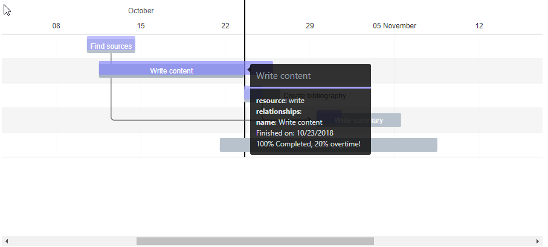

# Gantt chart extension

Based on initial work from Costin Badici, rewritten using typescript.

Two implementation are available, using different underlying libraries.

* Google charts version (_master_ branch): uses [google charts gannt](https://developers.google.com/chart/interactive/docs/gallery/ganttchart). It has a fixed set of capabilites, only works *online*, but has features like displaying the critical path.
* Frappe-Gantt (_frappe_ branch): uses [Gantt Frappe]. Much more lightweight, works offline, has the capability to display the current date, different view modes, and display baselines.

The Frappe-Gantt version is much more developed and is considered to be the *best* version.



## Usage

An example of usage, as well as sample data is available [here](/docs/sample_entities.xml) for import directly into thingworx.

Here are some of the most important properties to keep in mind when using the widget:

* _Data_: The widget expects a dataset with information about the tasks. While most of the fields that can be configured are self-explanatory here are the important ones:
  * _TaskID_: The id of the task. It's also used in the _Relationships_ property.
  * _Completed_: `0 -> infinity` value indicating the completednes ratio. If the value is greater that 100, we assume the _Start_ and _End_ parameters represent the planned value, and the _Completed_ value the actual value.
  * _Start_ and _End_: the planned timestamps of the task.
  * _CustomClass_: the custom class for the task. Here's an example of custom colors:
  ```
    .taskclass1 .bar {
        fill: blue;
    }
    .taskclass1 .bar-progress {
        fill: red;
    }
  ```

## Developing

### Building and publishing

The following commands allow you to build and compile your widget:

* `npm run build`: builds the production version of the widget. Creates a new extension zip file under the `zip` folder. The production version is optimized for sharing and using in production enviroments.
* `npm run upload`: creates a build, and uploads the extension zip to the thingworx server configured in `package.json`. The build is created for developement, with source-maps enabled.
* `npm run watch`: watches the source files, and whenever they change, do a build.